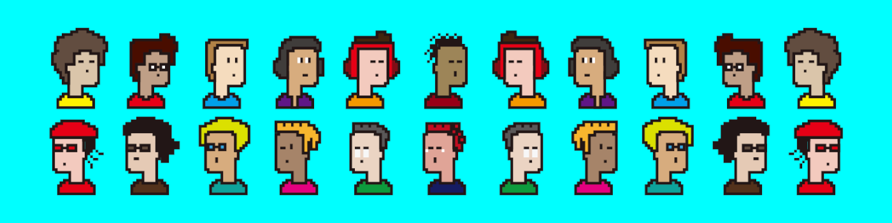
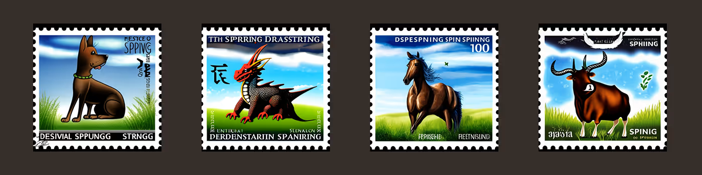
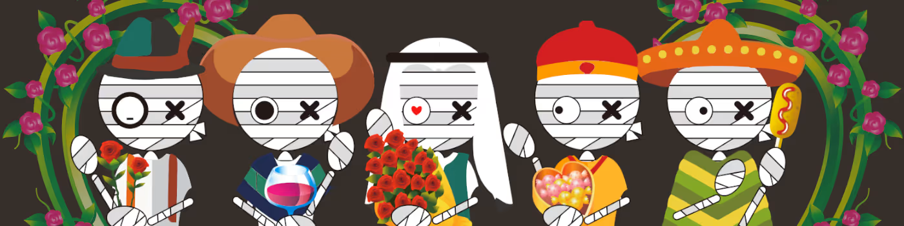

# Welcome to NFT Sharing Top
We are thrilled to announce the launch of multiple NFT collections, designed to bring boundless joy to our valued users. In the near future, we have exciting plans to introduce Real World Asset NFTs (rwaNFTs) that will be intricately intertwined with these collections. 

## 10. AvatarCoin
[AvatarCoin](https://opensea.io/collection/avatarcoin) is a collection of 10,000 unique NFTs, which are permanently fixed on Ethereum Blockchain. Only 2.5% of them have a Heart Accessory and 5% of them have a Cigarette Accessory. We hope that all of holders have funs with them. In near future, the rwaNFT connected to this collection will be launched.

  

## 9. Sakyamuni NFT
[Sakyamuni](https://opensea.io/collection/sakyamuninft) is a collection of 10,000 unique Tangka Style NFTs that are permanently fixed on Ethereum Blockchain. Among them,  fewer than 25% have a golden body, 10% feature a red line, and 20% showcase a gold lotus. We hope that all holders will have fun with them. In the near future, the rwaNFT connected to this collection will be launched.

  

## 8. StampAI
[StampAI](https://opensea.io/collection/stampai) is a collection of 24 unique NFTs generated by AI prompt automatically. These NFTs represent the secret Chinese zodiac and have all been permanently recorded on the Ethereum Blockchain. Here are their names: Rat, Ox, Tiger, Rabbit, Dragon, Snake, Horse, Goat, Monkey, Rooster, Dog, Pig.

  

## 7. Bandageman on Valentine's Day
[Bandageman on Valentine's Day](https://opensea.io/collection/bandageman-valentine-day) is a collection of 10,000 unique NFTs that are permanently fixed on Polygon Blockchain. Among them, fewer than 30% have a flower background, 10% feature a love eye, and 20% showcase a bunch of roses. We hope that all holders will have fun with them. In the near future, the rwaNFT connected to this collection will be launched.

  

## 6. Promotion Rabbit
[Promotion Rabbit](https://opensea.io/collection/promotionrabbit) is a collection of 10,000 unique Rabbit NFTs that are permanently fixed on Ethereum Blockchain. In Chinese culture, the rabbit symbolizes growth, promotion, and new beginnings. The year 2023 is the Chinese Year of the Rabbit (2023.2.4-2024.2.3), and the following Year of the Rabbit will be in 2035. We hope that all holders will have fun with them. In the near future, the rwaNFT connected to this collection will be launched.

  

## 5. Merry Christmas Tree
[Merry Christmas Tree](https://opensea.io/collection/merry-christmas-tree) is a collection of 5,000 unique NFTs that are permanently fixed on Ethereum Blockchain. MERRY CHRISTMAS ~ A bunch of Christmas Trees are on their way, are you ready! We hope that all holders will have fun with them. In the near future, the rwaNFT connected to this collection will be launched.

  

## 4. ChristmasDeer
[Merry Christmas with Gift Box ChristmasDeer](https://opensea.io/collection/christmasdeer) is a collection of 5,000 unique NFTs that are permanently fixed on Ethereum Blockchain. MERRY CHRISTMAS ~ A bunch of Christmas Deers are on their way, are you ready! We hope that all holders will have fun with them. In the near future, the rwaNFT connected to this collection will be launched.

  

## 3. SantaClaus
[Merry Christmas with Santa Claus On The Way](https://opensea.io/collection/santa-claus-on-the-way) is a collection of 5,000 unique NFTs that are permanently fixed on Ethereum Blockchain. MERRY CHRISTMAS ~ A bunch of Christmas Santa Claus are on their way, are you ready! We hope that all holders will have fun with them. In the near future, the rwaNFT connected to this collection will be launched.

  

## 2. VacuumBear
[VacuumBear](https://opensea.io/collection/vacuumbear) is a collection of 10,000 unique NFTs that are permanently fixed on Ethereum Blockchain. It comes from the fact that all of us began to wear masks in year 2020. Masks take big distances among everyone. In the near future, the rwaNFT connected to this collection will be launched.

  

 
## 1. BandagemanNFT
[BandagemanNFT](https://opensea.io/collection/bandagemannft) is a collection of 10,000 unique NFTs that are permanently fixed on Polygon Blockchain. We hope that all holders will have fun with them. In the near future, the rwaNFT connected to this collection will be launched.

  

## ▪ Welcome to join in

[http://nftsharing.top](http://nftsharing.top)

[http://nftsharing.top/2](http://nftsharing.top/2)

## ▪ Terms & Conditions
Before purchasing these NFTs, please read carefully the [Terms Of Service](http://nftsharing.top/terms/) and the [Terms & Conditions specific](http://nftsharing.top/nft-owner-agreement/). This explains all your rights and any restrictions.
